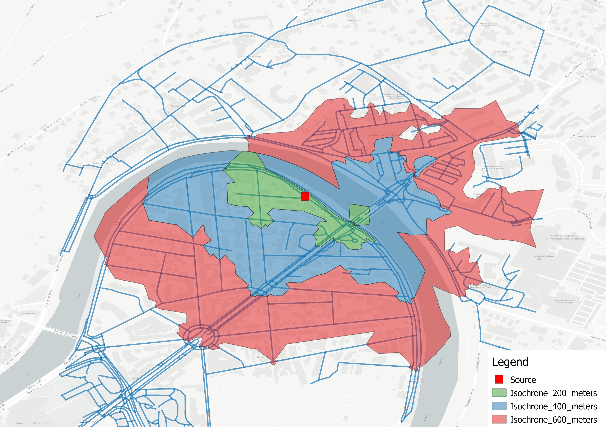
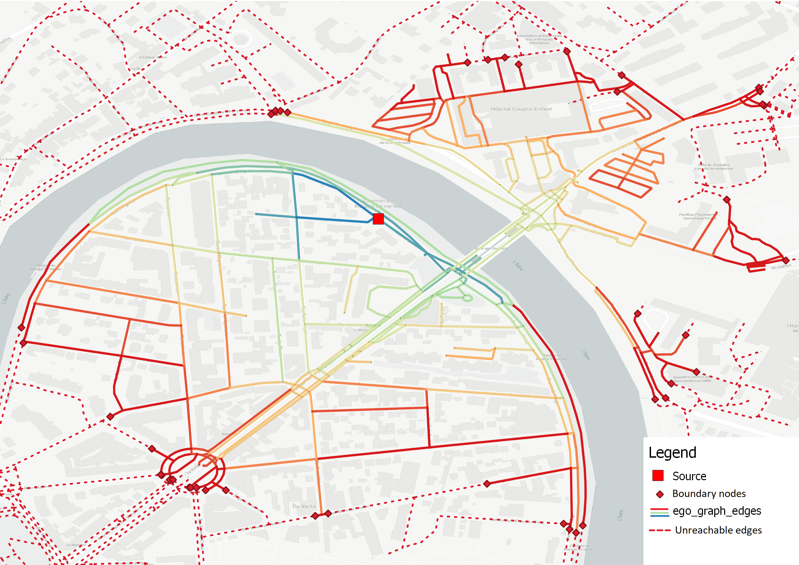
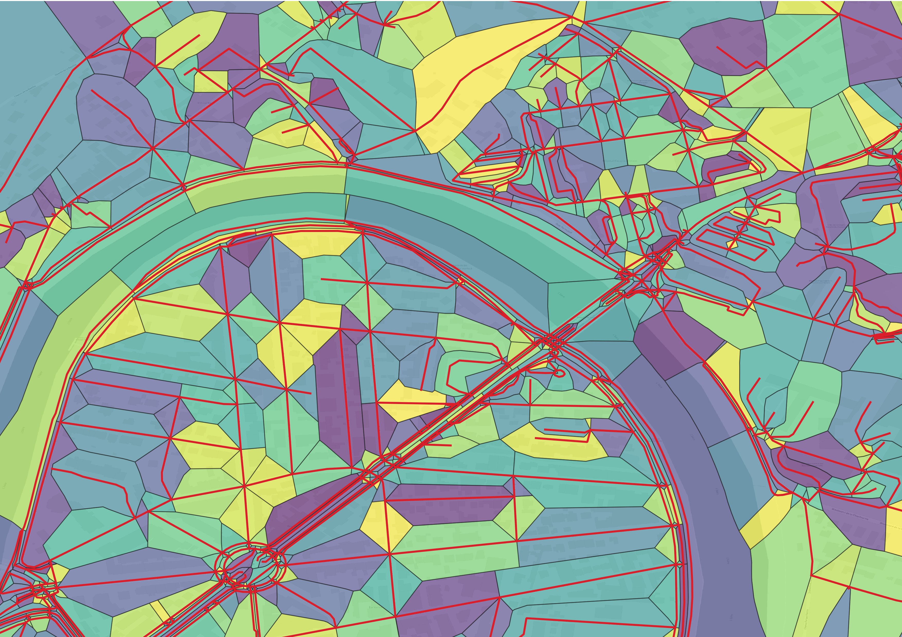
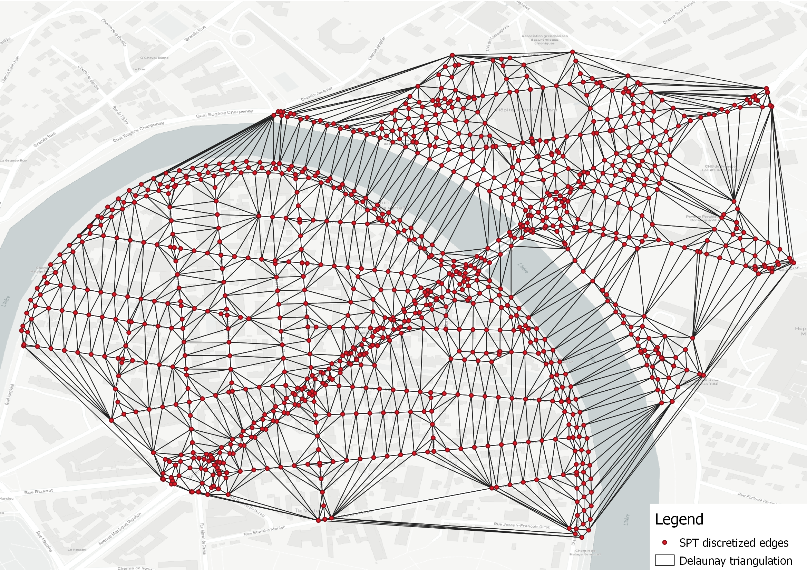
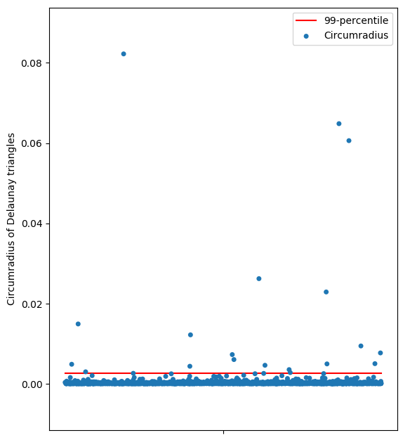

Isochrones
==========

Isochrones defines the reach of a location within a distance limit. An isochrone polygon is defined by all reachable
points from a source node trough a given geograph.

Using an additional distance function :math:`d_G: N \times N \rightarrow \mathbb{R}^+` corresponding to a shortest path
distance between two nodes in the graph, the isochrone polygon with source node :math:`n` and a distance
:math:`\epsilon` can be defined as:

    .. math::
        I_n^\epsilon := \{x \in S: d_G(n, i_x) + d(i_x, x) \leq \epsilon\}

with :math:`i_x := \text{proj}_L(x)`

The core method is based on Shortest Path Tree generation (SPT) (or ego-graph as in NetworkX). This tree contains all
nodes reachable within the :math:`\epsilon` distance from the source node. To get an isochrone polygon approximation,
this tree has to be "buffered" to represent the boundaries of the SPT.
Such polygons can be approximate by various methods (see `Isochrones OSM wiki <https://wiki.openstreetmap.org/wiki/Isochrone>`_).
Two methods have been implemented in GeoNetworkX:

    * :math:`\alpha`-shapes for fast approximation
    * Natural neighborhood with edges Voronoi cells computation for a precise approximation

The :math:`\alpha`-shape method produces most of the time good results at city scale. In contrast, edges Voronoi cells
produce a more faithful representation of isochrone polygons that can be interpreted at street scale.
Here is an example foreach method:

    Isochrone polygon example using natural neighborhood (Grenoble, France)

.. figure:: ../figures/Isochrone_example_alpha_shape.png
    :align: center
    :figclass: align-center

    Isochrone polygon example using alpha-shape (Grenoble, France)

Details about each method are provided below.

Shortest Path Tree
------------------

To compute an isochrone, GeoNetworkX uses shortest path tree computation that is implemented in NetworkX ``ego_graph``
method. An extended version is proposed to compute precisely the boundaries of a graph by using spatial information.
The proposed algorithm adds boundary nodes on edges leaving the ego-graph to represent the exact point where the cutoff
value is reach in the SPT. The coordinates of the boundary nodes are computed using a linear interpolation with edge
geometry length (see ``geonetworkx.generators.extended_ego_graph`` for more details). Here is an illustration of an
extended shortest path tree for a street network:

    Ego-graph (or SPT) example from a source node and 600 meters limit. Edges colors represent total length to the
    source.

Edges Voronoi cells
-------------------

For a given graph, this method computes voronoi cells of each edge. That is to say for each edge, all points closer to
this edge than any other edge. Formally, the voronoi cell :math:`V_e` of the edge :math:`e` is:

.. math::
    V_e := \{ x \in S : d(x, \text{proj}_{l_e}(x)) \leq  d(x, \text{proj}_{l_u}(x)), \forall u \in E \backslash \{e\} \}

From a shortest path tree :math:`T \subset G`, we define its influence polygon :math:`V_T` by all points closer to any
edge of :math:`T` than any edge of :math:`G` that is not in :math:`T`. That is to say:

.. math::
    V_T := \bigcup_{e \in E_T} V_e

Edges Voronoi cells are computed in GeoNetworkX thanks to the `PyVoronoi <https://github.com/Voxel8/pyvoronoi>`_ package
that provides an interface to the
`boost Voronoi library <https://www.boost.org/doc/libs/1_70_0/libs/polygon/doc/voronoi_main.htm>`_. This code allows
to compute cells for points and segments. A work has been done in GeoNetworkX to generalize this work to generic
`linestrings`. For instance, here is an example of the edges voronoi cells of a street graph:

    Edges Voronoi cells of a street graph.

:math:`\alpha`-shape
--------------------

:math:`\alpha`-shapes are a generalization of the concept of convex hull. For a finite set of points, it defines
a piecewise linear curve that forms a polygon that contains all points. It can be computed with the Delaunay
triangulation of the point set :math:`P` and with the circumradius of the triangles:

.. math::
    A_\alpha := \bigcup_{t \in \text{Delaunay}(P) : r(t) \leq 1/\alpha} t

With :math:`r(t)` the circumradius of the triangle :math:`t`.

Using this definition, :math:`A_0` represents the convex hull of :math:`P` and :math:`A_\inf` is the empty set (it
can be seen has the minimum spanning tree of the points).

Theses shapes can be used to approximate an isochrone polygon to "buffer" the SPT geometry. To do this, GeoNetworkx
compute an :math:`\alpha`-shape on a discretized edges of the SPT.

Here is an example of the Delaunay triangulation used to compute an :math:`\alpha`-shape.

    Delaunay triangulation of a discretization of SPT edges.

The parameter :math:`\alpha` is computed by taking a percentile of the circumradius of all triangles. For the same
example as above, here is the distribution of circumradius of triangles.

    Scatter plot of the circumradius of all triangles.

A "good" choice for :math:`1/\alpha` is the 99-percentile of the circumradius to exclude only outliers.
