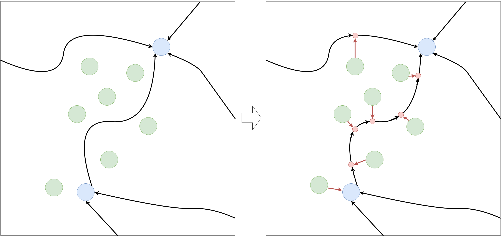
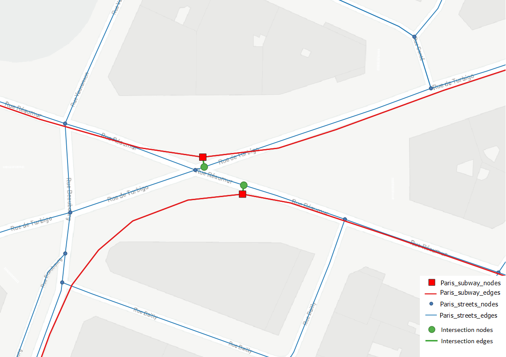

Spatial merge tools
===================

GeoNetworkX implements methods for map-matching points to the geograph. That is to say finding, for a query point, the
closest edge or node in a geograph. Mathematically, it means solving the following optimization problem for a query
point :math:`p \in S`:

    .. math::
        \min_{x \in L} d(p, x)

A frequently encountered problem is finding the closest edge in a geograph for a set of points :math:`P`. If done
naively, a nested loop on points and edges is performed to compute all distances. This introduces a high computational
cost (:math:`o(|P|\times|E|)`) that can be avoided by using the right data structure. GeoNetworkX uses kd-trees to
efficiently solve this problem. Theses allow to find the optimal solution without having to compute all distances
(:math:`o((|P| + |E|) \log|E| )`).

To compute the closest edge, all edge geometries are discretized within a tolerance distance :math:`\epsilon > 0`. This
method is not exact if the coordinate of the geograph are not unprojected (using latitude and longitude angles), but
produces fairly good results. The implemented method uses kd-trees implemented in the
`Scipy Spatial <https://docs.scipy.org/doc/scipy/reference/spatial.html>`_ package (see
`cKDTree <https://docs.scipy.org/doc/scipy/reference/generated/scipy.spatial.cKDTree.html#scipy.spatial.cKDTree>`_).

Spatial points merge
--------------------

GeoNetworkX implements a method to add a set of point to a geograph as nodes using the closest edge rule
(``gnx.spatial_points_merge``). This method not only find the closest edge but generate the new edges to connect the
new nodes to the geograph:

    Illustration of work done in the ``spatial_points_merge`` method. Initial geograph edges are in black, nodes in blue
    , new nodes are in green, new intersection nodes in red.

Here is an example that merge a set of bicycle station to a street network.

.. code-block:: python

    import geopandas as gpd
    import geonetworkx as gnx
    import osmnx as ox

    # Download and set up the street network (main streets_graph only)
    streets_graph = ox.graph_from_address("Rennes, France", distance=2500,
                                          infrastructure='way["highway"~"primary|secondary|tertiary"]')
    streets_graph = gnx.read_geograph_with_coordinates_attributes(streets_graph)

    # Getting the bicycle stations
    bicycle_stations = gpd.read_file("geonetworkx/tests/datasets/"
                                     "rennes_bicycle_stations_velo_star.geojson")

    # Merging the stations to the street network
    gnx.spatial_points_merge(streets_graph, bicycle_stations, inplace=True)

Spatial graph merge
-------------------

An additional useful feature that provides GeoNetworkX is geographs merge. That is to say, from a base graph, adding
another graph on top of it and setting the right edges connect both.
This feature may be very useful for multimodal transport routing. For example, a use case is to merge a street graph
with a subway system graph to find an optimal route combining walk and subway transportation. To do so, the closest
street of each subway station has to be found and an edge has to be added to link them. This is what is done in the
``gnx.spatial_graph_merge`` method.

Practically, this can be useful for merging two independent networks by specifying connecting nodes from one graph and
reachable edges from the other graph. For instance, it can be used to build a multi-modal network combining streets
network and subway network by connecting subway stations (represented as nodes) to their closest street (represented as
edges).

.. code-block:: python

    # streets: GeoMultiDiGraph
    # subway: GeoMultiDiGraph
    subway_node_is_station = lambda n: subway.nodes[n].get("name", None) is None
    streets_and_subway = gnx.spatial_graph_merge(streets,
                                                 subway,
                                                 node_filter=subway_node_is_station)

Here is a visualization of the result:

    Illustration of work done in the ``spatial_graph_merge`` method. Street network is in blue, subway network in red,
    and merging elements in green.

